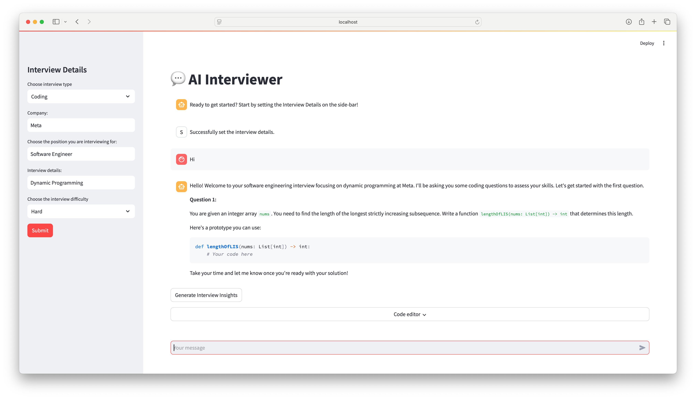

# AI Interviewer

Your personal AI mock interview platform.



## Setup

1. Ensure all packages in `requirements.txt` are installed
2. OpenAI API key stored in as environment variable

## Run 

To run frontend: 
```python3 -m streamlit run frontend.py```

To run backend
```python3 -m uvicorn backend:app --reload --host localhost --port 8000```

App is available at: http://localhost:8501
